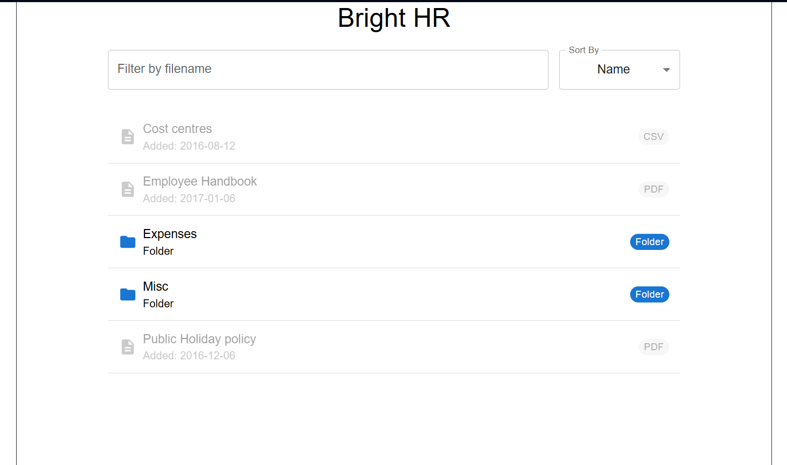
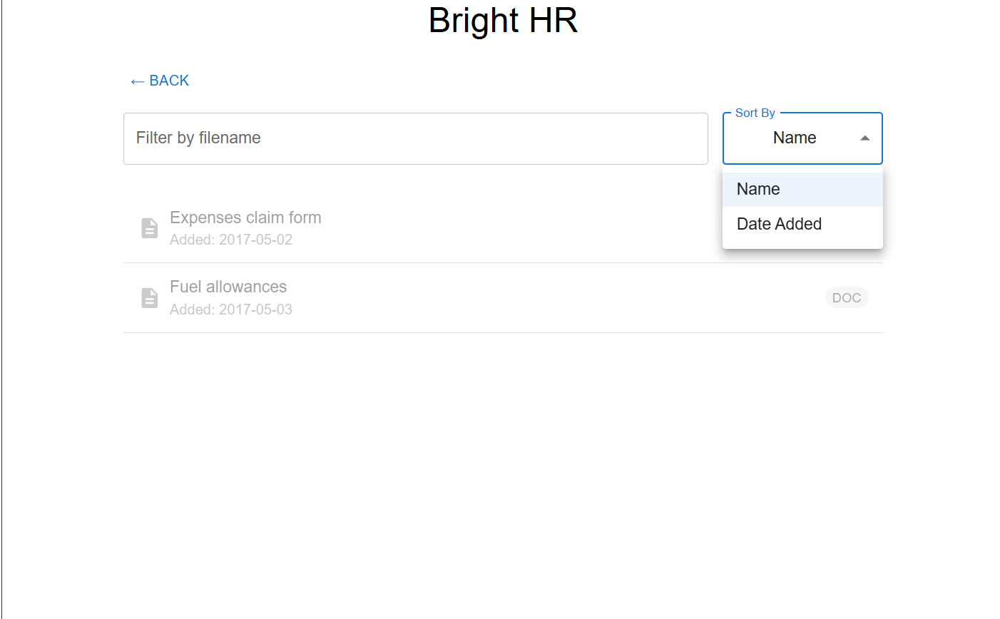

# BrightHR Finder

I had a bit more time to work on this so I believe I've completed the minimal requirements.

A few regrets over this project:

The simple unit tests, If I had more time I would've added some test testing the sorting logic more but the tests were just put together towards the end.

I used MUI to make the styling easier but I wouldve done the styling myself like I did for the main App page (Even though most of that css is from the vite setup).

The UI Compoenents would've been split up further just keep all the component files smaller.

# How to run the application

1. Install dependencies.
2. Run npm dev.
3. For the unit tests run npm test after installing all the dependencies.

# Dev Evidence

